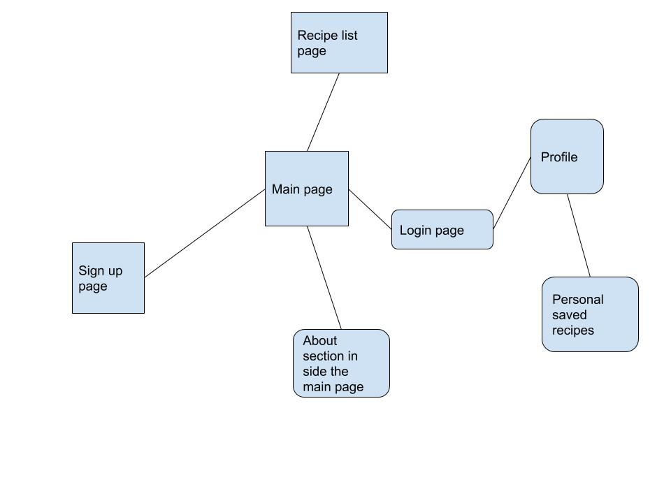

# WhipItUp

"Cooking made Easy"

## Descriptions and Users

whitIpUp is an app that help people cook a bit easier. the user will have a list of potential recipes maybe for dinner,lunch or breakfast. when the user click search, the app will return 4 potential recipes based on the filter selections, if the user is not satisfied with any of the 4 recipe, the user can search again and the app will return another potential recipes. regular users without a login will only have 2 tries. users with alogin can have as much as 4 tries, in order to get a recipe that might work best for the user.

## Users

- can login
- sign up
- get recipes

## App Links:

- [FrontPage](https://github.com/Besker1/WhipItup2/blob/master/wireframing/frontPage.html)
- [Recipes](https://github.com/Besker1/WhipItup2/blob/master/wireframing/recipes.html)
- [signin](https://github.com/Besker1/WhipItup2/blob/master/wireframing/Signin.html)
- [signUp](https://github.com/Besker1/WhipItup2/blob/master/wireframing/Signup.html)

# How use the backend for yourself

## For the backend make sure you are running

- node@12.19.1

- PostgreSQL 13

- create a database make the appopriate changes to the .env file to make your database

`Cd backend`

`npm install`

`npm run migrate -- 1`

`npm run seed `

`npm start to run the server`

- should be running on localhost 8000

# How to make the app fully functional

## set up the front end

`cd whipItup`

`npm install`

- make sure the backend url in the app.js state is the same.

and run `npm start`

the app should be running perfectly and use it as your own
